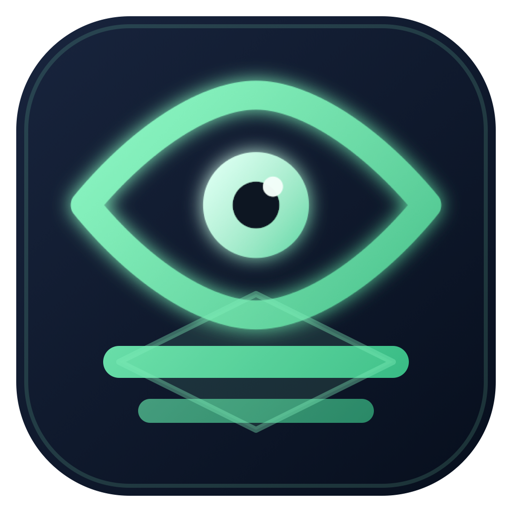
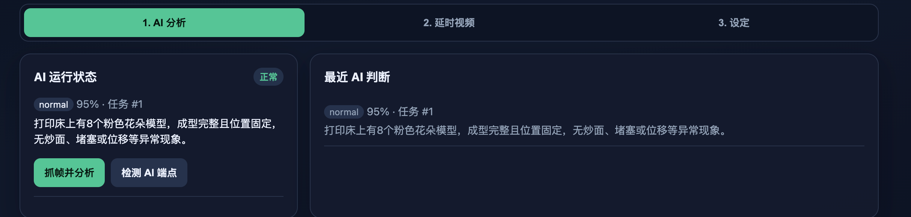
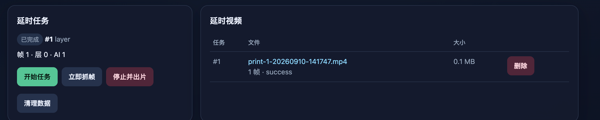
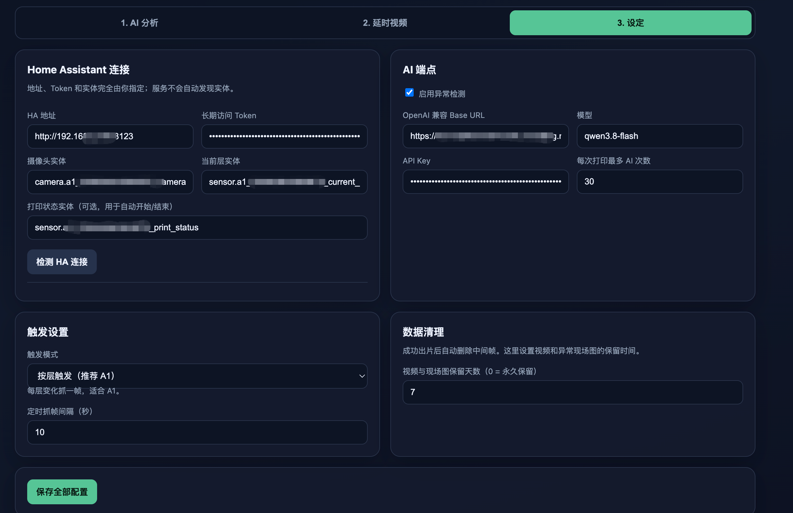

<p align="center">
  
</p>

<h1 align="center">LayerWatch</h1>

<p align="center">
  <a href="https://github.com/zhf883680/LayerWatch">https://github.com/zhf883680/LayerWatch</a><br>
  <a href="README.md">简体中文</a> | <a href="README.en.md">English</a>
</p>

> **LayerWatch uses AI-powered vision monitoring through Home Assistant cameras to monitor Bambu Lab 3D printing, detect failures such as spaghetti, clogs, displacement, and collisions, and automatically create timelapse videos.**

- Captures images from a Home Assistant camera entity. No direct RTSP management.
- AI anomaly detection for spaghetti, clogging/material buildup, shifted objects, and nozzle collisions.
- Timelapse video generation using the same captured frames and automatic MP4 encoding after printing, playable in the web UI.
- Triggering by layer changes or a fixed time interval. Entity IDs are explicitly configured with no auto-discovery.
- Notifications through Home Assistant persistent notifications and optionally Bark. No webhook or image host required.
- Lighting control can turn on a Home Assistant light before capture and keep it on during printing.
- Automatic cleanup of videos and alert images by retention period, with intermediate frames removed after encoding.
- Built-in defaults for FFmpeg, database, storage, and encoding settings.
- Bilingual web interface with Chinese and English language switching.

## Screenshots

### AI Analysis



### Timelapse



### Settings



## Configuration

```yaml
homeAssistant:
  baseURL: "http://homeassistant.local:8123"
  token: "Home Assistant long-lived access token"
  cameraEntity: "camera.bambu_lab_camera"
  layerEntity: "sensor.bambu_lab_current_layer"
  statusEntity: "sensor.bambu_lab_print_status"

ai:
  enabled: true
  baseURL: "https://dashscope.aliyuncs.com/compatible-mode/v1"
  apiKey: "Vision model API key"
  model: "qwen3-vl-flash"
  maxChecksPerPrint: 50
  minIntervalSeconds: 30

trigger:
  mode: "layer" # layer | interval
  intervalSeconds: 10 # interval mode only, minimum 2 seconds

cleanup:
  retentionDays: 7 # 0 = keep forever

lighting:
  enabled: false
  entity: "light.bambu_lab_chamber_light"
  delaySeconds: 3
  keepOnDuringPrint: true

notification:
  haEnabled: true # Home Assistant persistent notifications
  barkEnabled: false
  barkKey: ""
  barkBaseURL: "https://api.day.app"
  barkGroup: "LayerWatch"
  barkLevel: "" # active / timeSensitive / critical
  barkVolume: 0 # critical volume, 0-10
```

Settings can also be edited from the web interface. The Home Assistant token and AI API key are stored in the configuration file, so restrict access to that file.

## Run with Docker (recommended)

End users do not need to clone or compile the source. Pull the published Docker image directly:

```text
zhf883680/layerwatch:latest
```

The image supports `amd64`, `arm64`, and `armv7`. Docker selects the correct architecture automatically.

```bash
mkdir -p "$HOME/layerwatch/data"

docker run -d   --name layerwatch   --restart unless-stopped   --pull always   -p 19091:19091   -v "$HOME/layerwatch/data:/app/data"   -e TZ=Asia/Shanghai   zhf883680/layerwatch:latest
```

Open `http://<server-ip>:19091` and configure Home Assistant, AI, triggers, and notifications on the Settings page. Configuration and data are stored in:

```text
$HOME/layerwatch/data/config.yaml
$HOME/layerwatch/data/monitor.db
```

Update the image:

```bash
docker pull zhf883680/layerwatch:latest
docker rm -f layerwatch
```

Run the same `docker run` command again. Data in the mounted directory is preserved.

You can also use the included `docker-compose.yml`:

```bash
docker compose pull
docker compose up -d
```

## Development

```bash
go run ./cmd/server
```

FFmpeg must be installed locally, or set `FFMPEG_BINARY` to the executable path. Build the Docker image from source with:

```bash
docker build -t layerwatch .
```

Automated publishing requires these GitHub Actions secrets:

```text
DOCKERHUB_USERNAME
DOCKERHUB_TOKEN
```

## Trigger Rules

### By Layer (recommended for Bambu Lab)

1. LayerWatch reads `homeAssistant.statusEntity` every 2 seconds.
2. A print task starts automatically when the state becomes `printing`, `running`, or `prepare` (naming differs between HA integration versions; the log line is only written when the state changes).
3. It reads `homeAssistant.layerEntity` and captures one frame when the layer number increases.
4. It stops and starts encoding when the state becomes `idle`, `finished`, `failed`, `stopped`, or `offline`.
5. A paused task remains active and continues when new layers appear after resuming.

If the status entity is empty, the task starts on the first valid layer number. Use `POST /api/session/stop` to stop it manually.

### By Time Interval

The first frame is captured as soon as the print state becomes `printing`, `running`, or `prepare`. Additional frames are captured every `intervalSeconds`. No frames are captured while paused, and encoding starts when the print finishes.

## Home Assistant Entities

Typical entities exposed by the official Bambu Lab Home Assistant integration:

- Camera: `camera.<printer>_camera`
- Current layer: `sensor.<printer>_current_layer`
- Print status: `sensor.<printer>_print_status` or `sensor.<printer>_status`

Use Home Assistant Developer Tools → States to confirm the actual entity IDs. LayerWatch never guesses paths or entities.

## Night Lighting

AI detection may fail when the printer chamber is dark. Configure a Home Assistant light in **Settings → Lighting Control**:

```yaml
lighting:
  enabled: true
  entity: "light.bambu_lab_chamber_light"
  delaySeconds: 3
  keepOnDuringPrint: true
```

Behavior:

- `delaySeconds`: turn on the light and wait this many seconds before capture so camera exposure stabilizes.
- `keepOnDuringPrint: true`: turn on the light for the first capture and keep it on until the print task ends.
- `keepOnDuringPrint: false`: turn the light on only around each capture and turn it off immediately afterward.
- If the light was already on, LayerWatch does not turn it off when the task ends.
- Lighting failures are logged but do not block camera capture.

## API

```text
GET    /api/status
GET    /api/config
PUT    /api/config
POST   /api/test/ha
POST   /api/test/ai
POST   /api/test/notification
POST   /api/test/light
POST   /api/session/start
POST   /api/session/stop
POST   /api/session/layer?layer=N
POST   /api/session/capture
GET    /api/sessions
GET    /api/checks
GET    /api/checks/{id}/image
GET    /api/videos
GET    /api/videos/{id}/file
DELETE /api/videos/{id}
POST   /api/cleanup
GET    /api/health?deep=1
```

The legacy LapseCam endpoints `/api/quick/start`, `/api/quick/stop`, `/api/quick/snapshot?layer=N`, and `/api/quick/check` are also compatible.

## AI Detection and Alerts

After each capture, LayerWatch analyzes the five most recent frames together. A notification is sent to every enabled HA/Bark channel when:

- AI classifies the result as abnormal;
- confidence is at least 0.8;
- three consecutive checks are abnormal;
- at least five minutes have passed since the previous alert.

Each print task can make at most `maxChecksPerPrint` AI calls. Set it to `0` for unlimited calls.

`minIntervalSeconds` is the minimum gap between two AI analyses (default 30, `0` = unlimited): when layers change quickly, frames are still captured but AI is not called back-to-back.


## AI Cost Estimate

The following estimate uses the provided `qwwen-3.7-flash` pricing:

- Normal input: CNY 0.2 per million tokens
- Cache-hit input: 10% of normal input price, or 0.2 × 10% = CNY 0.02 per million tokens
- Output: CNY 0.8 per million tokens

Assume 2000 tokens per call, including 56 output tokens:

```text
Input = 2000 - 56 = 1944 tokens
Observed cache-hit ratio = 512 ÷ 1680 ≈ 30.48%
Estimated cache-hit input ≈ 1944 × 30.48% ≈ 592 tokens
Estimated non-cached input ≈ 1944 - 592 = 1352 tokens
```

Cost of one AI call:

```text
Output: 56 ÷ 1,000,000 × 0.8 = CNY 0.0000448
Cache-hit input: 592 ÷ 1,000,000 × 0.02 = CNY 0.00001184
Non-cached input: 1352 ÷ 1,000,000 × 0.2 = CNY 0.0002704

Total per call:
0.0000448 + 0.00001184 + 0.0002704 ≈ CNY 0.000327
```

At an estimated 30 AI calls per 3D print:

```text
0.000327 × 30 = CNY 0.00981
```

**Conclusion: the estimated AI cost is approximately CNY 0.0098 per print, or about 0.98 Chinese cents — less than one cent.**

If calculated from the actual usage of 1736 tokens instead of the 2000-token estimate, the cost is approximately **CNY 0.00866 per print, or about 0.87 Chinese cents**.

> Actual cost varies with model pricing, image size, cache hit rate, and the number of frames analyzed per call. This estimate is for reference only.

## Data

The default data directory is `./data`:

```text
data/
  monitor.db
  frames/session-<id>/
  videos/
  events/session-<id>/
```

Cleanup runs every six hours and removes videos and alert images according to `cleanup.retentionDays`. Intermediate frames are deleted immediately after successful encoding.
